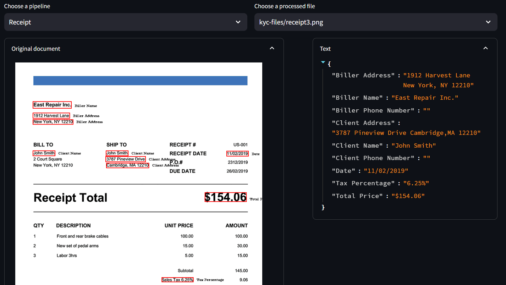

# KYC Information Extraction from Documents with Dynamic Pipeline

Welcome to the KYC Information Extraction project! This repository provides a comprehensive solution for managing Know Your Customer (KYC) information extraction from documents through a dynamic pipeline. Users can choose the features they want to extract, manage files through a custom UI, and apply OCR and information extraction processes with ease. The project is built with several key components, including a pipeline manager, process runner, and visualization tools.

## Features

### Dynamic Pipeline Management
- **Feature Selection:** Choose the specific information you want to extract from documents.
- **Pipeline Templates:** Add, delete, and update templates for feature extraction.
- **Custom UI Integration:** Manage files and pipelines through a user-friendly interface powered by Supabase.

### OCR and Information Extraction
- **Process Runner:** Apply OCR on selected or all documents with a toggle.
- **File/Pipeline Connector:** Extract specific information based on the selected pipeline and store results in a database.
- **Execution Tracking:** Each step updates the database to ensure accurate process monitoring.

### Visualization Tools
- **OCR Visualization:** Visual representation of OCR results with features highlighted.
- **Information Extraction Visualization:** Detailed view of extracted information with feature-specific boxes.

## Installation

To use this project, follow these steps:

1. **Create a Conda Environment:**
    ```bash
    conda create -n kyc_extraction python==3.9
    conda activate kyc_extraction
    ```

2. **Install Required Packages:**
    ```bash
    pip install -r requirements.txt
    ```

## Project Structure

- **APIs/kaggle_notebooks/KYC_APIs:** Contains two APIs hosted in a single Kaggle notebook.
  - **LlamaCPP Server:** Hosts an LLM, currently using a fine-tuned version of Mistral.
  - **OCR API:** Utilizes PaddleOCR for text extraction from images. This will be upgraded to the Unstructured API for managing various file types and adding document layout and table recognition features.

## Libraries Used

- `pandas`
- `numpy`
- `streamlit`
- `langchain`
- `requests`
- `supabase`
- `regex`
- `pillow`

## How to Use

1. **Set Up the Environment:**
    Ensure you have the necessary environment and dependencies set up as described in the installation section.

2. **Run the Application:**
    Launch the custom UI to start managing files and pipelines.

3. **Manage Pipelines:**
    Add, delete, or update pipeline templates as needed through the UI.

4. **Process Documents:**
    Use the process runner to apply OCR on selected or all documents and extract information based on the chosen pipeline.

5. **Visualize Results:**
    Check the OCR and information extraction visualizations to see the results with features highlighted.



## Future Enhancements

- **Upgrade OCR API:** Transition from PaddleOCR to the Unstructured API for enhanced file management and improved document layout and table recognition.
- **Expand Feature Extraction:** Add more customizable features and templates for broader KYC information extraction capabilities.
- **Function Calling and Tool Calling:** Implement Pydantic for function calling and tool calling to enhance robustness and validation of extracted data.
